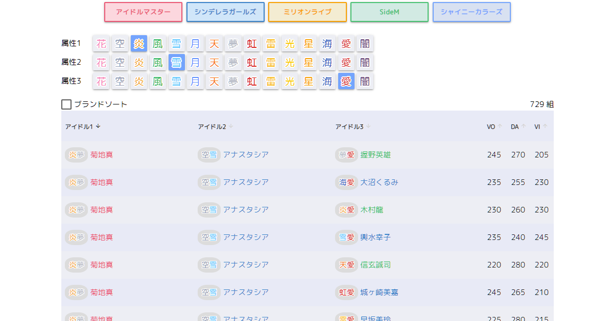

# PopUnit

PopUnit はスマートフォンゲーム「[ポップリンクス](https://poplinks.idolmaster-official.jp/)」の
ユニット結成を補助するためのサイトです。



## Prerequisites

- node >= 14.15.0
- npm >= 6.14.0

## Build

1. Clone  
  ```git clone https://github.com/ytya/popunit.git```
2. Install npm packages  
  ```npm install```
3. build  
  ```npm run build```

## Update Idol Data

1. Edit csv  
  [idol-data.csv](data/idol-data.csv)
2. Convert to json  
  ```
  cd data
  node csv2json.mjs
  ```
